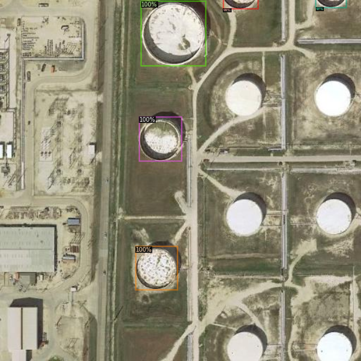
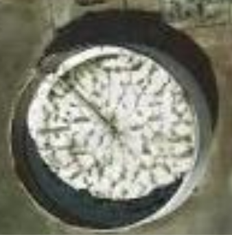
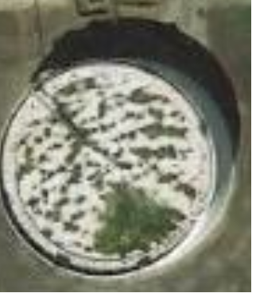

## Motivation
The world’s oil prices fluctuate at the whim of the OPEC nations and other oil producing countries, and are to a very large extent related to the production capacity of such countries. However, another factor that plays a crucial role in determining oil prices, is the available stock of crude oil kept in storage tanks worldwide. Many nations tend not to share this information with the public, making it very difficult to estimate the supply of crude oil available, and by extension, making it difficult to speculate on the future price of oil.
Investors from large corporations down to the individual lack a reliable and fast updating source of information to keep them well informed of supplies of crude oil which would help them greatly and more accurately speculate on the price of crude oil.

## Aim
We want to create a system that is able to estimate the supply of crude oil worldwide through analysing satellite imagery of storage tanks at oil tank farms.
Our system will analyse storage tanks around the world and identify the external floating roof tanks. From there, it will estimate the volume of oil it contains based on the relative size of the tank and the size of the shadow cast in the tank, which through mathematical processing, indicates the volume of crude oil contained in it.
Scaled up, our system will be able to calculate the volume of crude oil contained in this specific type of storage tank worldwide and provide our customers with a rough estimate of the world’s crude oil reserves.

## Process of training
Model has to train on every image in the training set for multiple epochs to be able to find a tank from a satellite image

## Process of validation
Model has to recognise and extract a bounding box of a tank from the image. 

Model has to find the shadow within the tank and calculate the ratio of the shadow to the tanks without a shadow to calculate the capacity of the tank

Model computes this for validation images and checks accuracy against validation data

## Examples

### Tanks that are recognised by the model

### Tank that is close to empty

### Tank that is full

